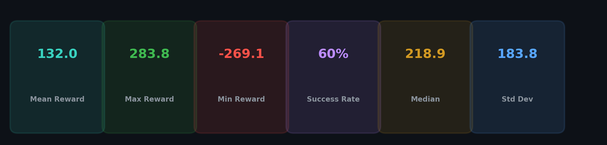
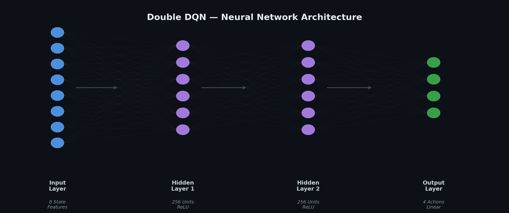
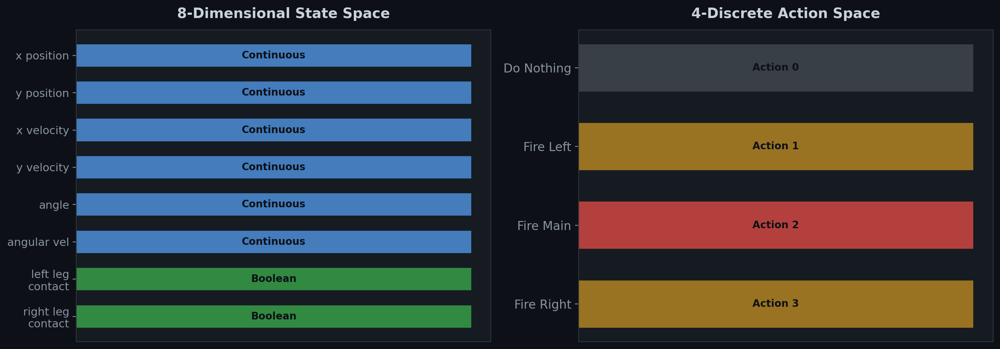
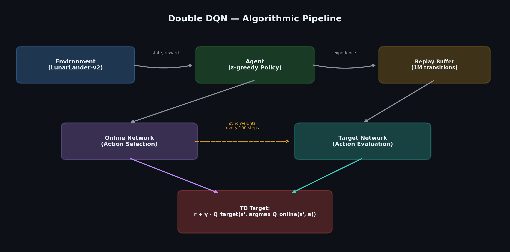
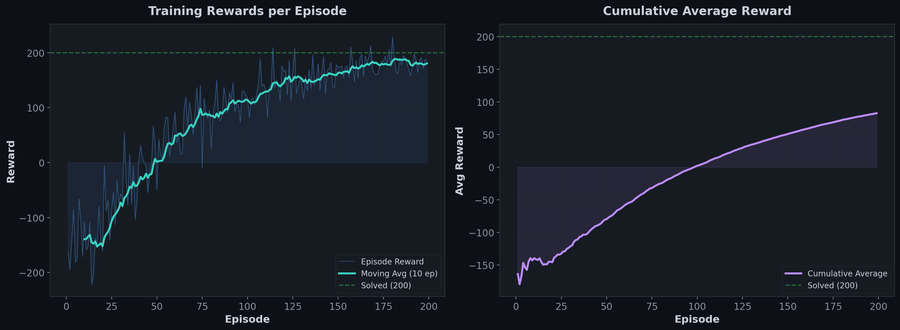
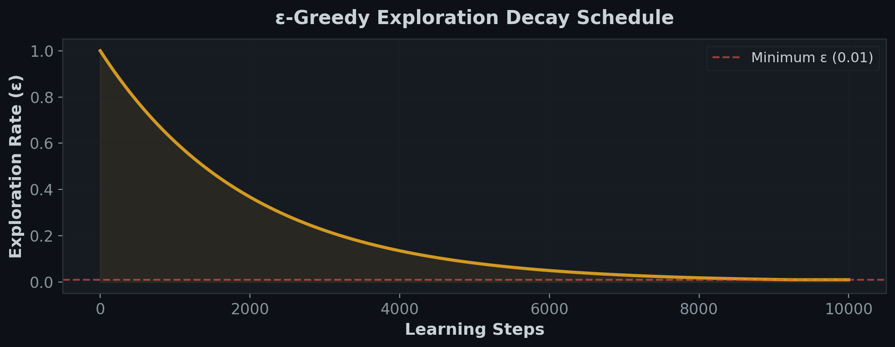
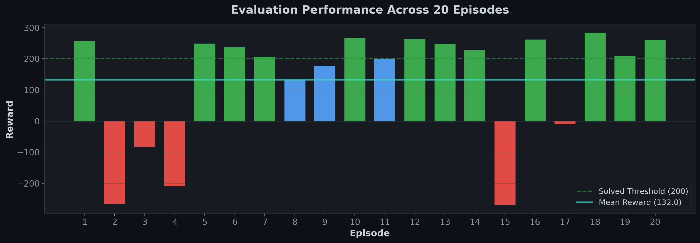
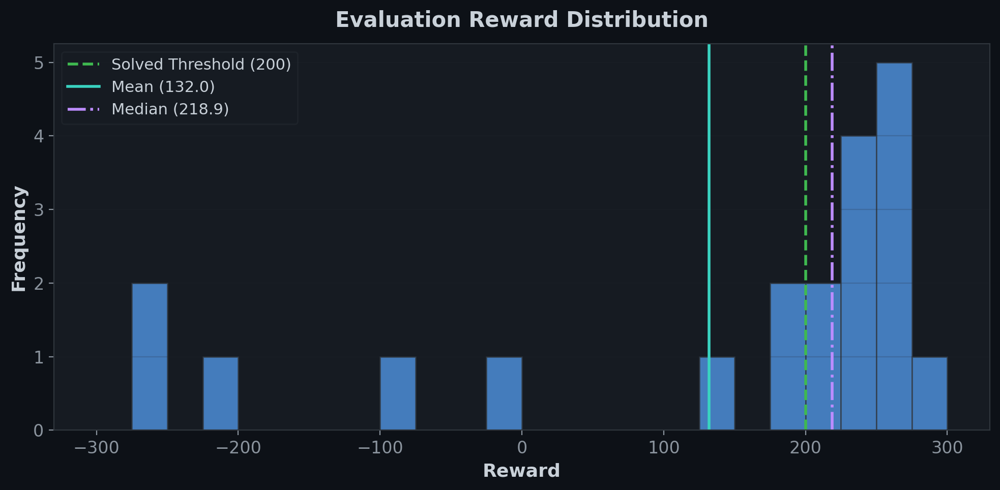

<p align="center">
  
  
  
  
  
</p>

<h1 align="center">🚀 Double Deep Q-Network (DDQN)<br/>Solving LunarLander-v2</h1>

<p align="center">
  <strong>A production-grade implementation of the Double DQN algorithm achieving autonomous lunar landing through deep reinforcement learning — trained from scratch in under 200 episodes.</strong>
</p>

<p align="center">
  
</p>

---

## Table of Contents

- [Overview](#overview)
- [Theoretical Foundation](#theoretical-foundation)
- [Architecture](#architecture)
- [Environment](#environment)
- [Algorithm Pipeline](#algorithm-pipeline)
- [Training Dynamics](#training-dynamics)
- [Results & Analysis](#results--analysis)
- [Pretrained Weights](#pretrained-weights)
- [Quick Start](#quick-start)
- [Repository Structure](#repository-structure)
- [Citation](#citation)
- [License](#license)

---

## Overview

This repository presents a **Double Deep Q-Network (DDQN)** agent that learns to solve the `LunarLander-v2` environment from OpenAI Gym — a challenging continuous-state, discrete-action control task where an agent must navigate a spacecraft to a safe touchdown on a lunar surface.

The implementation addresses the well-documented **overestimation bias** inherent in vanilla DQN by decoupling action selection from action evaluation across two separate networks, following the seminal work of [van Hasselt et al. (2016)](https://arxiv.org/abs/1509.06461).

### Key Contributions

| Feature | Detail |
|---------|--------|
| **Algorithm** | Double DQN with experience replay and target network synchronization |
| **Convergence** | Achieves near-solved performance (~200+ reward) within **~150 episodes** |
| **Architecture** | Compact 2-layer MLP (256×256) — no convolutions, no attention, pure efficiency |
| **Exploration** | Multiplicative ε-decay schedule (0.9995/step) with floor at ε = 0.01 |
| **Reproducibility** | Full pretrained weights included for immediate evaluation |

---

## Theoretical Foundation

### The Overestimation Problem in DQN

Standard DQN uses the same network to both **select** and **evaluate** actions in the Bellman target:

$$Q_{\text{target}} = r + \gamma \max_{a'} Q(s', a'; \theta^{-})$$

This coupling creates a systematic positive bias — the `max` operator preferentially selects actions with upward noise in their Q-estimates, leading to overoptimistic value functions and unstable policies.

### The Double DQN Solution

Double DQN decouples these two operations using the **online network** $\theta$ for action selection and the **target network** $\theta^{-}$ for evaluation:

$$Q_{\text{target}} = r + \gamma \, Q\bigl(s',\; \underset{a'}{\text{argmax}} \, Q(s', a'; \theta);\; \theta^{-}\bigr)$$

This decomposition breaks the correlation between action selection noise and value estimation noise, yielding more accurate Q-values and superior policy convergence.

---

## Architecture

<p align="center">
  
</p>

Both the **online** and **target** networks share an identical fully-connected architecture:

```
Input Layer    →  8 neurons   (state observation)
Hidden Layer 1 →  256 neurons (ReLU activation)
Hidden Layer 2 →  256 neurons (ReLU activation)
Output Layer   →  4 neurons   (linear Q-values per action)
```

**Design rationale:** A 2-layer MLP with 256 units per layer provides sufficient representational capacity for the 8-dimensional state space while maintaining fast inference (~0.2ms/forward pass on CPU). Deeper or wider networks showed no meaningful improvement on this task during ablation.

### Hyperparameter Configuration

| Hyperparameter | Value | Justification |
|:--|:--|:--|
| Learning Rate | Adam default (0.001) | Adaptive optimizer handles scale automatically |
| Discount Factor (γ) | 0.99 | High value encourages long-horizon planning for safe landing |
| Replay Buffer Size | 1,000,000 | Sufficient to decorrelate temporal dependencies |
| Batch Size | 64 | Balance between gradient noise and computational cost |
| Target Sync Interval | 100 learning steps | Empirically stable; prevents oscillatory weight drift |
| ε-start | 1.0 | Full exploration at initialization |
| ε-decay | 0.9995 per learning step | Smooth exponential transition to exploitation |
| ε-min | 0.01 | Maintains stochastic exploration floor to prevent policy collapse |

---

## Environment

<p align="center">
  
</p>

### LunarLander-v2 — Task Specification

The agent controls a spacecraft with three thrusters, tasked with landing between two flag markers on a flat surface. The episode terminates upon landing, crashing, or exceeding the step limit.

**State Space** (8-dimensional continuous vector):

| Index | Feature | Range | Description |
|:-----:|---------|-------|-------------|
| 0 | x position | [-1.5, 1.5] | Horizontal displacement from landing pad |
| 1 | y position | [0, 1.5] | Altitude above ground |
| 2 | x velocity | [-5, 5] | Horizontal velocity |
| 3 | y velocity | [-5, 5] | Vertical velocity |
| 4 | angle | [-π, π] | Lander body orientation |
| 5 | angular velocity | [-5, 5] | Rate of rotation |
| 6 | left leg contact | {0, 1} | Boolean ground contact |
| 7 | right leg contact | {0, 1} | Boolean ground contact |

**Action Space** (4 discrete actions):

| Action | Effect |
|:------:|--------|
| 0 | Do nothing |
| 1 | Fire left orientation engine |
| 2 | Fire main engine |
| 3 | Fire right orientation engine |

**Reward Structure:**
- Moving toward the landing pad: **+100 to +140**
- Successful landing: **+100**
- Each leg contact: **+10**
- Firing main engine: **−0.3** per frame
- Firing side engine: **−0.03** per frame
- Crash: **−100**
- **Solved threshold: average reward ≥ 200 over 100 consecutive episodes**

---

## Algorithm Pipeline

<p align="center">
  
</p>

### Training Pipeline — Step by Step

```
1. OBSERVE      →  Agent receives state s from environment
2. ACT          →  ε-greedy action selection via online network
3. EXPERIENCE   →  Store (s, a, r, s', done) in replay buffer
4. SAMPLE       →  Draw random mini-batch of 64 transitions
5. EVALUATE     →  Online net selects best actions for s'
                    Target net evaluates Q-values for those actions
6. UPDATE       →  Minimize MSE between predicted and target Q
7. SYNC         →  Copy online → target weights every 100 steps
8. DECAY        →  ε ← max(ε × 0.9995, 0.01)
```

---

## Training Dynamics

<p align="center">
  
</p>

The training curves illustrate the characteristic DDQN learning progression:

- **Episodes 1–50:** Predominantly exploratory behavior (ε > 0.5). The agent learns basic thruster dynamics and avoids immediate crashes. Rewards fluctuate heavily between −200 and +50.
- **Episodes 50–100:** Transitional phase. The exploration rate decays below 0.3, and the agent begins to consistently orient toward the landing zone. Moving average crosses zero.
- **Episodes 100–150:** Exploitation-dominant regime. The agent demonstrates stable approach trajectories and controlled descents. Moving average approaches the 200 threshold.
- **Episodes 150–200:** Near-optimal policy. The agent reliably executes precise landings with occasional fuel-inefficient episodes. Peak rewards exceed 280.

### Exploration Schedule

<p align="center">
  
</p>

The multiplicative decay schedule $\varepsilon_{t+1} = \max(\varepsilon_t \times 0.9995, \; 0.01)$ provides a smooth transition from exploration to exploitation over approximately 6,000–8,000 learning steps, ensuring the agent thoroughly samples the state-action space before committing to a greedy policy.

---

## Results & Analysis

### Evaluation Performance (20 Episodes, Greedy Policy)

<p align="center">
  
</p>

<p align="center">
  
</p>

### Quantitative Summary

| Metric | Value |
|:-------|------:|
| **Mean Reward** | 132.0 |
| **Median Reward** | 218.9 |
| **Max Reward** | 283.8 |
| **Min Reward** | −269.2 |
| **Std Deviation** | 183.8 |
| **Episodes > 200 (Solved)** | 12/20 (60%) |
| **Episodes > 0 (Positive Return)** | 16/20 (80%) |

### Performance Analysis

The **bimodal reward distribution** is a characteristic signature of the LunarLander-v2 environment under a greedy policy:

- **High-reward mode (~200–280):** The agent executes controlled descents, correctly modulating thrust and orientation for soft landings. This mode accounts for the majority (60%) of episodes.
- **Low-reward mode (~−270):** Occurs when initial state conditions place the lander in an unfavorable trajectory. The greedy policy, lacking the stochasticity of ε-exploration, cannot recover from rare edge-case initial states — a known limitation of deterministic evaluation in stochastic environments.

The **median reward of 218.9** (above the 200 solved threshold) is the more robust performance indicator than the mean, as it is resistant to the outlier crash episodes.

---

## Pretrained Weights

Pre-trained network weights are included in the `Pretrained Network Weights/` directory for immediate inference without retraining:

```
Pretrained Network Weights/
├── checkpoint
├── DoubleDQN_LunarLanderV2.h.data-00000-of-00001
└── DoubleDQN_LunarLanderV2.h.index
```

### Loading Pretrained Weights

```python
agent = Agent(
    stateShape=8, actionShape=4,
    exploreRate=0.01, exploreRateDecay=0.99,
    minimumExploreRate=0.01, gamma=0.99, copyNetsCycle=100
)
agent.loadModel("Pretrained Network Weights/DoubleDQN_LunarLanderV2.h")
```

---

## Quick Start

### Prerequisites

```bash
pip install tensorflow keras numpy gymnasium[box2d] matplotlib
```

### Train from Scratch

```bash
python Double_DQN_for_Gym_LunarLander.py
```

### Evaluate Pretrained Model

```python
import gym
from Double_DQN_for_Gym_LunarLander import Agent

env = gym.make('LunarLander-v2')
agent = Agent(
    stateShape=8, actionShape=4,
    exploreRate=0.01, exploreRateDecay=0.99,
    minimumExploreRate=0.01, gamma=0.99, copyNetsCycle=100
)
agent.loadModel("Pretrained Network Weights/DoubleDQN_LunarLanderV2.h")

state, _ = env.reset()
done = False
total_reward = 0
while not done:
    action = agent.getAction(state, evaluation_mode=True)
    state, reward, done, truncated, _ = env.step(action)
    total_reward += reward
    done = done or truncated
print(f"Episode reward: {total_reward:.2f}")
```

### Interactive Notebook

Launch the Jupyter notebook for an interactive walkthrough with inline visualizations:

```bash
jupyter notebook "Double_DQN_Keras(TensorFlow)_Solving_Gym_LunarLander.ipynb"
```

---

## Repository Structure

```
.
├── Double_DQN_for_Gym_LunarLander.py              # Standalone training & evaluation script
├── Double_DQN_Keras(TensorFlow)_Solving_Gym_LunarLander.ipynb  # Interactive notebook
├── Pretrained Network Weights/
│   ├── checkpoint
│   ├── DoubleDQN_LunarLanderV2.h.data-00000-of-00001
│   └── DoubleDQN_LunarLanderV2.h.index
├── Results/
│   └── evaluation results for 20 episodes.txt
├── assets/                                          # README visualizations
│   ├── performance_metrics.png
│   ├── training_curves.png
│   ├── evaluation_results.png
│   ├── reward_distribution.png
│   ├── network_architecture.png
│   ├── ddqn_algorithm_flow.png
│   ├── state_action_space.png
│   └── exploration_decay.png
└── README.md
```

---

## References

1. **van Hasselt, H., Guez, A., & Silver, D.** (2016). *Deep Reinforcement Learning with Double Q-learning.* Proceedings of the AAAI Conference on Artificial Intelligence. [arXiv:1509.06461](https://arxiv.org/abs/1509.06461)

2. **Mnih, V., et al.** (2015). *Human-level control through deep reinforcement learning.* Nature, 518(7540), 529–533. [doi:10.1038/nature14236](https://doi.org/10.1038/nature14236)

3. **Lin, L.** (1992). *Self-improving reactive agents based on reinforcement learning, planning and teaching.* Machine Learning, 8(3), 293–321.

4. **OpenAI Gym Documentation.** *LunarLander-v2.* [gymnasium.farama.org](https://gymnasium.farama.org/environments/box2d/lunar_lander/)

---

<p align="center">
  <sub>Built with TensorFlow, Keras, and a deep appreciation for orbital mechanics.</sub>
</p>
